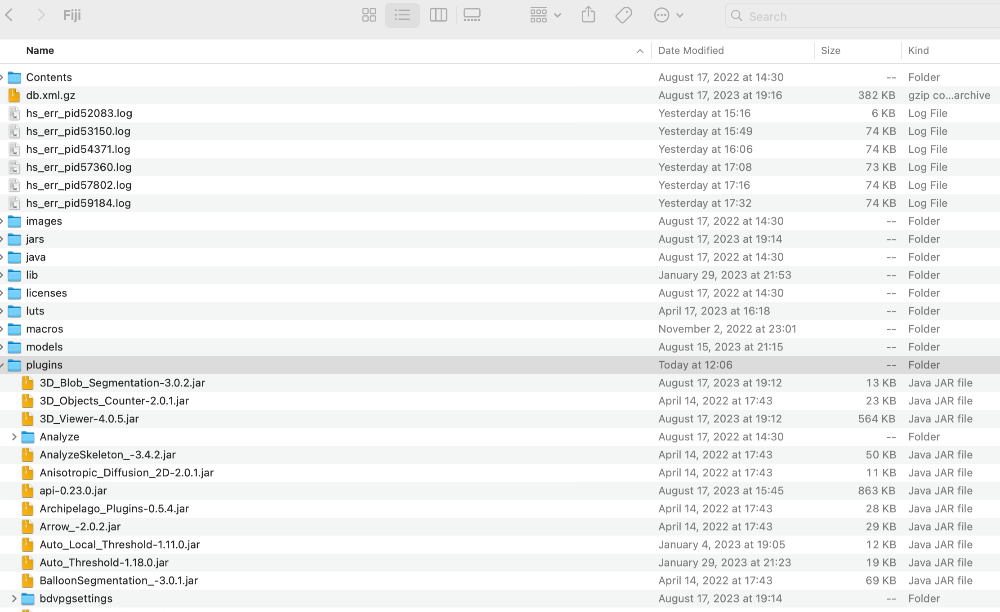
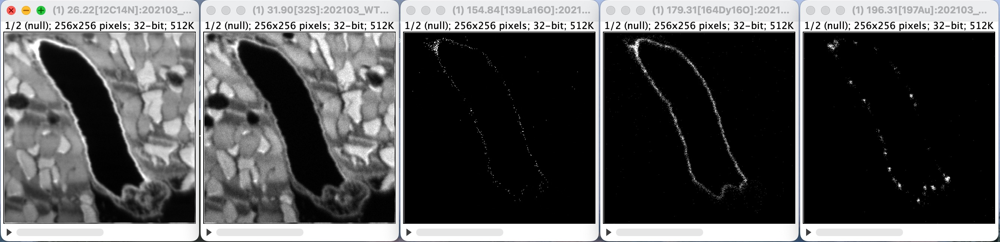
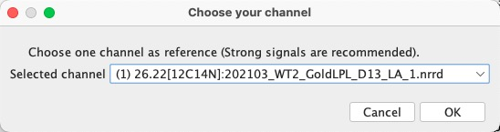

## NanoSIMS Stabilizer manual

This repository contains the source code for our NanoSIMS stabilizer ImageJ plugin. 

If you prefer running with Python code, which allows batch processing and GPU acceleration, please refer to https://github.com/Luchixiang/NanoSIMS_Stabilizer_Python. 

For more information, please refer to our [project page](https://www.haibojianglab.com/nanosims-stabilizer) or our [paper on JACS](https://pubs.acs.org/doi/10.1021/jacs.4c05384). 
### Install Plugin

Please note that we don't support macOS before 11.  

1. Download the plugin jar files through the [link](https://zenodo.org/records/11638194) according to your system (Linux, macOS, Windows). 
3. move all the jar files into the Fiji plugins folder and restart the ImageJ finish the installation.

### Run Correction

1. Ensure that you have installed the [OpenMIMS plugin](https://usermanual.wiki/Pdf/OpenMimsManual.682350371.pdf)
2. Open your NanoSIMS file in OpenMIMS. 

3. Click plugin -> NanoSIMS Stabilizer -> stabilize

4. Choose the channel as the reference channel where the transformation map is calculated and then applied to other channels. Strong signals are recommended. The summation denotes using the summation of all channels as reference channel (suitable for datasets that all channels are weak).  
By default, we apply nearest interpolation to weak signal channels, but it may change the overall signals. Check the box if you want to apply bilinear interpolation to all channels.

   

5. Correction Done. 
